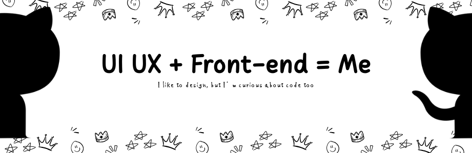

<!---->

<h2>Hi... I'm rookie 👋</h2>

 I like learning design because it's fun and colorful 😊 Creating a program also makes me curious 🧐 I started learning Python but ended up getting stuck 🥴 and now I'm starting to like it, yay...!!! 😆 (that's because I'm starting to understand it little by little 🥲)

My favorite movies, anime and k-dramas... (I can't possibly list them all, can I? 🤔)

###

  
  
  
  

###

  

###

  
 

###

<picture>
  <source media="(prefers-color-scheme: dark)" srcset="https://raw.githubusercontent.com/anjarnegara/anjarnegara/output/pacman-contribution-graph-dark.svg">
  <source media="(prefers-color-scheme: light)" srcset="https://raw.githubusercontent.com/anjarnegara/anjarnegara/output/pacman-contribution-graph.svg">
  
</picture>

###

