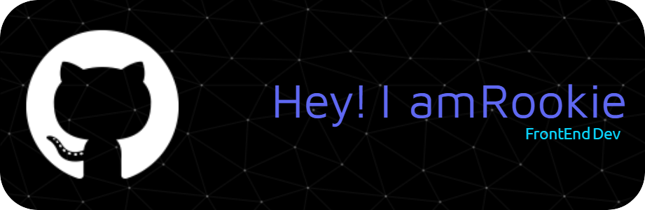

<h3 align="center">A passionate frontend developer from Indonesia</h3>

- 🌱 I’m currently learning **Front end and UI UX **

- 📫 How to reach me **septaranja@gmail.com**

- ⚡ Fun fact **always on Antartika mode**

<h3 align="left">Languages and Tools:</h3>

      

<h2>Pickman</h2>

<picture>
  <source media="(prefers-color-scheme: dark)" srcset="https://raw.githubusercontent.com/anjarnegara/anjarnegara/output/pacman-contribution-graph-dark.svg">
  <source media="(prefers-color-scheme: light)" srcset="https://raw.githubusercontent.com/anjarnegara/anjarnegara/output/pacman-contribution-graph.svg">
  
</picture>

###
